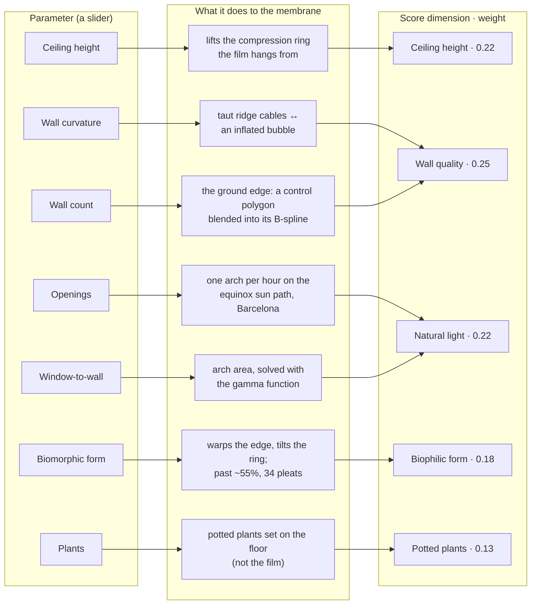
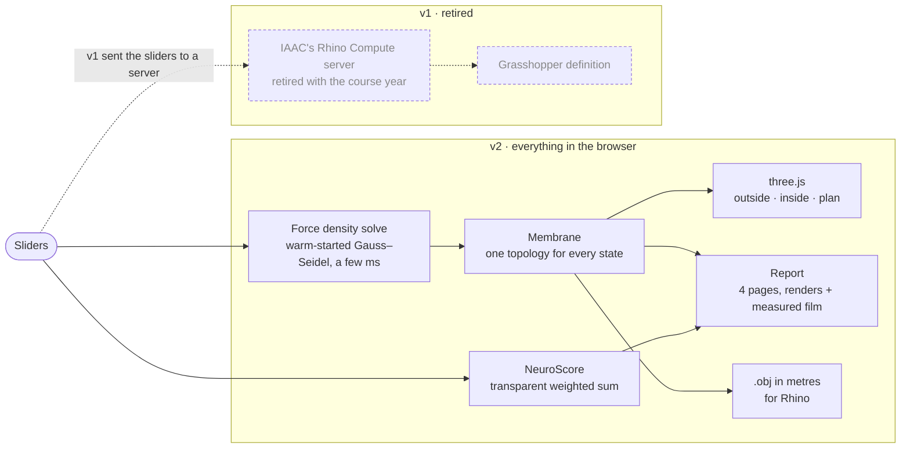

# NeuroSpace

> **Status: v2, running entirely in the browser.** The room is form-found live in code, so
> nothing can retire underneath it. [Open the lab](https://hi-em.github.io/neurospace/).
>
> v1 computed its geometry through Grasshopper on IAAC's course Rhino Compute server, which was
> retired when the course year ended; the room stopped rendering while the score, which never
> left the browser, kept working. v2 rebuilt the geometry in code from the rules. It is not a
> port of the Grasshopper definition, and it claims no fidelity to it. The v1 state is tagged
> [`v1-rhino-compute`](https://github.com/hi-em/neurospace/tree/v1-rhino-compute).

A lab for one question at a time: change one thing in a room, and NeuroSpace estimates what
that change does to the person inside it. Pick a question (does a higher ceiling lower stress
potential? do curved walls read calmer than corners?), move one slider, and compare your
variant against a control room, side by side or by holding F.

It is BIM reframed: Building Information Modeling to Behavior Information Modeling. The
information that matters is not only what a building is made of, it is what the building is
doing to the person inside it.

Built solo, for MaCAD (Master in Advanced Computational Design for Architecture II) at IAAC, by
Emilie El Chidiac.

## How it works

**The room: one tensioned membrane, form-found live.** [`src/geometry/membrane.js`](src/geometry/membrane.js)
solves a cable net with the force density method (Schek, 1974, written for Frei Otto's Munich
Olympic roof): every node sits where its neighbours' pulls balance, solved by over-relaxed
Gauss–Seidel. With no pressure the net is a soap film; with pressure it inflates toward a bubble,
but only until its crown meets the compression ring, so the ring is always the top of the room.

- **Ceiling height** lifts the ring the film hangs from.
- **Wall count and curvature**: the ground edge is a control polygon blended into its cubic
  B-spline, at equal floor area. Low curvature pulls taut ridge cables; high curvature inflates.
- **Openings and window-to-wall**: superellipse arches, one per hour on the equinox sun path
  over Barcelona, their area solved with the gamma function.
- **Biomorphic form** warps the film up to about 40%; past about 55% it pleats into the regular,
  high-contrast repetition the visual-stress research flags.

The net keeps one topology for every slider state, so a change is a warm-started re-solve of a
few milliseconds: the room morphs rather than rebuilds. The same solver draws the 3D question
icons and the report's renders, and the report measures the solved film (volume, envelope,
standing headroom). The membrane exports as `.obj` in metres for Rhino.

**The rules, from slider to score:**



**The score: a weighted sum in the browser** ([`src/utils/neuroScore.js`](src/utils/neuroScore.js)).
It answers as fast as you can drag.



Stack: Vue 3, three.js, Vite; html2canvas and jsPDF for the report.

## The score, and how to argue with it

The NeuroScore is a **transparent weighted sum**, not an instrument. It estimates; it does not
measure anything about your body, and it makes no clinical claim. Weights:

| Dimension | Weight | Reading |
|---|---|---|
| Ceiling height | 0.22 | cognitive freedom |
| Wall curvature and count | 0.25 | visual stress |
| Daylight, opening count and size | 0.22 | wellbeing |
| Biophilic organic form | 0.18 | optimal around 0.4, not maximal |
| Potted plants | 0.13 | attention restoration |

They lean on neuroarchitecture research, principally the work of Dr. Cleo Valentine, turned
into numbers a designer can read. They are in the repo on purpose: a score you can argue with
beats a number you have to trust. The Method panel in the app shows the same model as a flow
and as a weight matrix.

**Three curves changed on 2026-09-29; the weights did not.**

- Ceiling height now levels off at 3.5 m instead of rising without limit.
- Wall count only counts once the walls are curved: more corners are not calmer.
- Plants score on presence first (any plant earns most of the benefit), then a little more per
  plant up to five.

The citations and the wording of every rule were checked against the sources the same day.

## Honest notes

- **The score is a heuristic.** A defensible reading of published research, not a measurement.
  Argue with it rather than cite it.
- **Depending on someone else's server was the real mistake in v1.** It cost the demo when the
  course's Rhino Compute server was retired. v2 removes the dependency instead of re-hosting it.
- **Without WebGL there is no room to draw.** A browser with its graphics switched off gets a
  picture of the room and the question icons baked in `public/fallback/`, and a line saying so;
  the questions and the score still work, because they never needed 3D.
- **The geometry is a reading of the rules, not the original definition.**
  [`src/assets/neuro-space.gh`](src/assets/neuro-space.gh) is kept as the v1 record; it is a
  binary Grasshopper file and nothing in v2 was derived from it by translation.

## Running it locally

```bash
npm install
npm run dev      # local dev server
npm run build    # production build
```

Deploys to GitHub Pages from `master` via `.github/workflows/deploy.yml`.

## More

The long read: [The data pipeline behind NeuroSpace, from sliders to synapses](https://blog.iaac.net/the-data-pipeline-behind-neurospace-from-sliders-to-synapses/)

The project page: [emiliechidiac.com/work/neurospace](https://emiliechidiac.com/work/neurospace)
